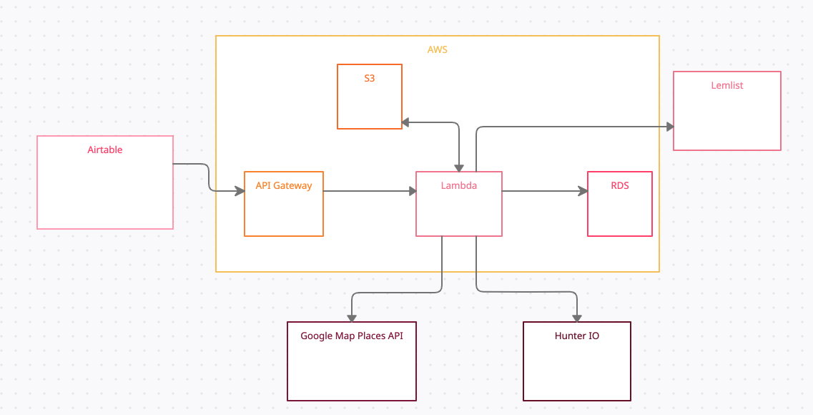

# Cold Email and Business Information Collection Workflow

## Introduction
This is a cold email and company business information collection workflow. Nowadays online product selling platforms are
getting the most attention and getting bigger with the time. People are also getting dependent on this platform. 
This project is based on automating the email and information collection processes.  Online marketing, email campaigns 
are getting a huge amount of attention nowadays.  Emails and company information are the important element of online 
marketing. This workflow includes scraping, integration of different third party applications, building a database, a 
Restful backend and generating potential leads.

## Overview of the tools and technologies
###Airtable: 
Airtable is a data management tool with lots of features and apps to work around. I am using this application to store 
the information for a short time in a relational structure and at the same time it is also used to trigger some event. 
It is a very important part for an event based architecture. As I am using  the event based architecture so it helps me 
to get the user input and trigger an event based on that.

### Airtable Script: 
Airtable script is a very useful application for airtable. This is a built in app with airtable. We can use javascript 
as a language in the script. Using this script we can create events and act against the events to do some tasks like 
CRUD operation in airtable and integrate the airtable with other systems.

### Airtable Automation: 
Airtable offers automation applications. We can create workflows using the airtable automation and run them based on 
events. It consists of tasks which will be executed step by step.

### AWS Lambda: 
AWS Lambda is a serverless function where we can run a function to do some tasks. This is a very important part of a 
serverless architecture. We can use as much resources as we need to execute the function. 

### API Gateway: 
API Gateway is a AWS service to uniquely identify a resource. We can build API unique urls using this service. It offers
us to add method type, validate the data and data format passed through an url and pass json data and invoke lambda 
functions through the unique API Gateway. We can map each resource with a lambda function to invoke and pass the 
necessary data to the function.

### S3: 
AWS S3 is a storage service. We can store files of any format here and it offers us to trigger events on different 
operations like put objects, delete objects etc. 

### RDS: 
AWS RDS is a relational database management system offered by AWS. It offers many database engines like MySQL, Oracle, 
PostgreSQL etc. I am using the MySQL engine to build our database here.

### Google Map Places API: 
Google map places API Provides the service of searching nearby places in google map. Google map Places API just provides
the same data in Json format in return for the API request. We can use keywords to search the places near or related to 
that keyword. 

### Hunter IO: 
Hunter IO is an email provider for a given domain. One can get the existing emails under a domain name through their API 
service. For example lamose.ca is a domain that has email like hello@lamose.ca. If we make an API request with this domain 
name to hunter it will return this email in return.

### Lemlist: 
Lemlist is a campaign management tool or web application which provides the facilities like create campaigns, add emails 
to that campaign, send them in a scheduled manner, follow up them and based on the response you can keep the email or 
delete from the campaign. We have used this tool to send emails to our potential customers and track them.

## System Design:
###Overview: 
This workflow starts from Airtable, ends at Airtable and in between it goes through API Gateway, Lambda, S3, RDS, 
Google Map Places API, Hunter IO and Lemlst. This workflow consists of server tasks including upload city list to S3, 
Insert the cities into Database from S3, Get the City list from Database, Select campaigns for which we want to collect 
emails, Create query string or search string from cities in database and campaign selected from Airtable and put them 
into S3, Trigger Lambda function for each Put event in S3. Collect company information and email for the query for which 
the lambda function invoked, Store them into the database and return back to Airtable and update the campaign row. Now 
again trigger a script from Airtable for getting back the emails into the Airtable and AIrtable will call the API to get 
emails stored in the database.

Fig: System Design

### Airtable and API Gateway: 
Airtable has a one directional connection with API Gateway. Airtable. Airtable connects through two API 
“/location/query-string” and “/email/location”. First one creates a query string and second one gets the emails and 
associated location information. 

### Lambda and S3: 
Lambda is bidirectionally connected with S3. There are two Lambda functions from where the S3 put event is generated. 
The “post_location” function put location details as json in the “lamose-location-list” bucket and  the “create_target” 
function put the query data as json in the “query-list-province-wise”  bucket. At the same time S3 also invokes the 
lambda functions on each put event in the “cities-province-wise”, “lamose-location-list” and “query-list-province-wise”. 
“Post_location” function is invoked from any put operation in the “query-list-province-wise” bucket. “Insert_city” 
function is invoked from any put operation in the “Cities-province-wise” bucket. “Get_emails” function is invoked from 
any put operation in the “lamose-location-list” bucket.

### Lambda to RDS: 
Our serverless architecture contains  two layers of lambda functions. One layer is a middleware between the RDS and the 
external systems and another layer is the database layer which directly interacts with the database. So the functions 
which create a connection between Lambda and RDS are the database layer functions. Here is the list of database layer functions.
* Get_cities_by_province_db
* Get_email_and_location_by_province_db
* Get_emails_by_location_id_db
* Get_location_by_name_db
* Get_location_db
* Get_locations_city_db
* Get_province_name_country_db
* insert_city_db
* update_domain_in_location_db

### Lambda and Google Map Place API: 
Google Map API requests are made from “Post_location” function. 

### Lambda and Hunter IO: 
Hunter API requests are made from “Get_emails” function.

### Lambda and Lemlist: 
Lemlist API requests are made from the “lemlist-add-lead-in-campaign” function. 
