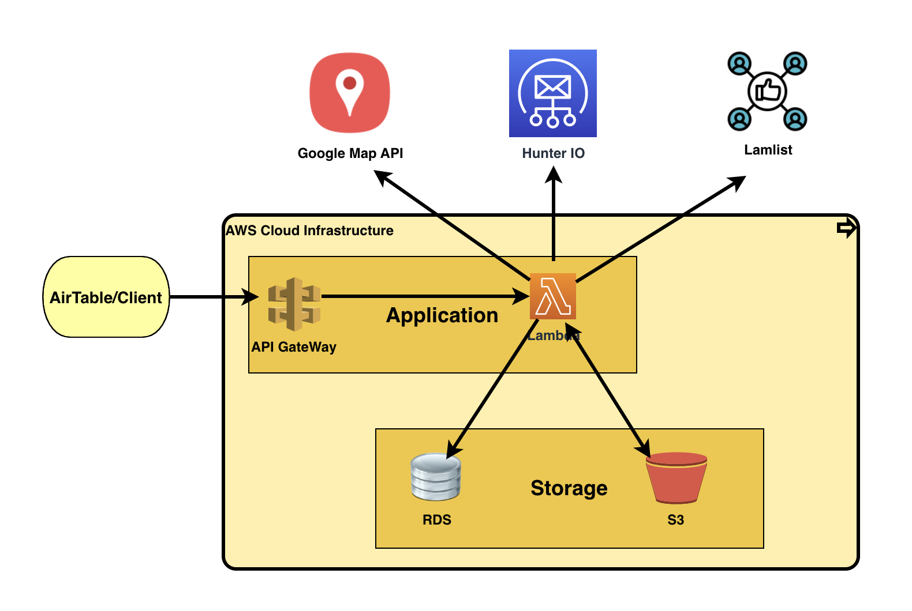

# Cold Email and Business Information Collection Workflow

## Introduction
Nowadays online product selling platforms are getting the most attention and getting bigger with time. Emails and company 
information are the important element of online marketing. Here we tried to automate 
the email and information collection processes. This is an event driven architecture which is developed on AWS infrastructure
and integrates third party applications in it and has the flexibility to be integrated with further applications.

## Overview of the tools and technologies
###Airtable: 
Airtable is a data management tool with lots of features and apps to work around. I am using this application to store 
the campaign details in tabular structure and trigger on insert event to start the flow. 

### Airtable Script: 
Airtable script is a very useful application for airtable. This is a built in app with airtable.It supports javascript 
for scripting. Based on the any event on airtable we can fire this script.

### Airtable Automation: 
Airtable offers automation applications. We can create workflows using the airtable automation and run them based on 
events. It consists of tasks which will be executed step by step.

### AWS Lambda: 
AWS Lambda is a serverless function where we can write scripts to do specific tasks. It is very useful service for a micro service 
architecture. Here we used lambda to act on events in s3 and invoke from api gateway.  

### API Gateway: 
API Gateway is a AWS service to uniquely identify a resource. We can build unique API endpoints using this service. It offers
us to add method type, validate the data and data format passed through an url and pass json data and invoke lambda 
functions. We can map each resource with a lambda function to invoke and pass the 
necessary data to the function.

### S3: 
AWS S3 is a storage service. We can store files of any format here and it offers us to trigger events on different 
operations like put objects, delete objects etc. 

### RDS: 
AWS RDS is a relational database management system offered by AWS. It offers many database engines like MySQL, Oracle, 
PostgreSQL etc. I am using the MySQL engine to build our database here.

### Google Map Places API: 
Google map places API Provides the service of searching nearby places in google map. Google map Places API just provides
the same data in Json format in return for the API request. We can use keywords to search places based on that keyword. 

### Hunter IO: 
Hunter IO is an email provider for a given domain. One can get the existing emails under a domain name through their API 
service. For example lamose.ca is a domain that has email like hello@lamose.ca. If we make an API request with this domain 
name to hunter it will return this email in return.

### Lemlist: 
Lemlist is a campaign management tool or web application which provides the facilities like create campaigns, add emails 
to that campaign, send them in a scheduled manner, follow up them and based on the response you can keep the email or 
delete from the campaign. We have used this tool to send emails to our potential customers and track them.

## System Design:
###Overview: 
This workflow starts from Airtable, ends at Airtable and in between it goes through API Gateway, Lambda, S3, RDS, 
Google Map Places API, Hunter IO and Lemlst. This workflow consists of server tasks including upload city list to S3, 
Insert the cities into Database from S3, Get the City list from Database, Select campaigns for which we want to collect 
emails, Create query string or search string from cities in database and campaign selected from Airtable and put them 
into S3, Trigger Lambda function for each Put event in S3. Collect company information and email for the query for which 
the lambda function invoked, Store them into the database and return back to Airtable and update the campaign row. Now 
again trigger a script from Airtable for getting back the emails into the Airtable and AIrtable will call the API to get 
emails stored in the database.

Fig: System Design

